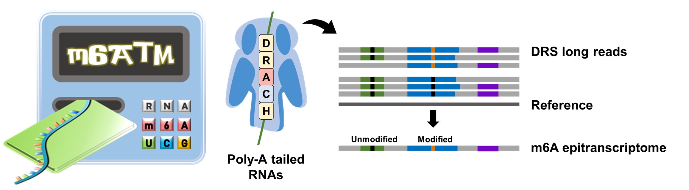
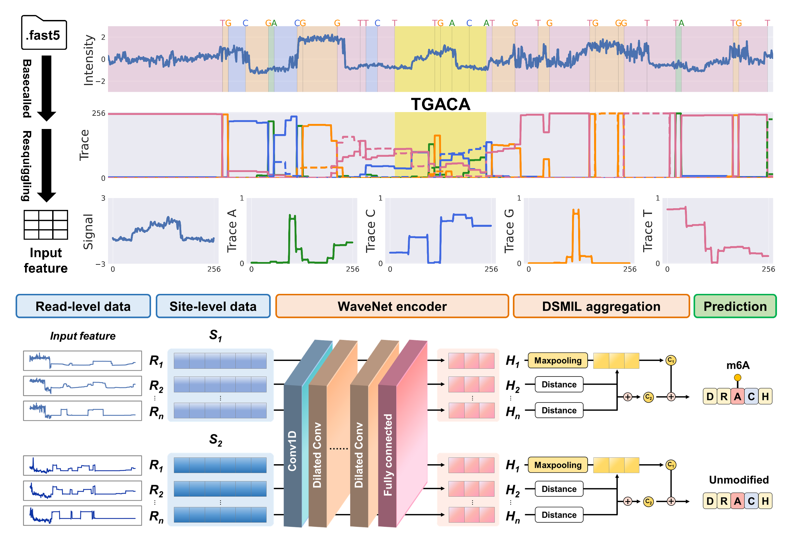
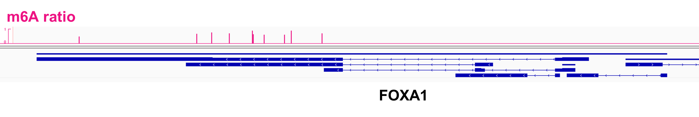

# m6ATM v1.0.0
 

## Installation
```
git clone https://github.com/poigit/m6ATM.git
cd m6ATM/src
```
```shell
conda create -n m6atm python=3.7
conda activate m6atm
python -m pip install .
pip install torch==1.10.1+cu111 torchvision==0.11.2+cu111 -f https://download.pytorch.org/whl/cu111/torch_stable.html
```
<br>

## Data preparation
We recommend starting from raw .fast5 data to prevent any missing values in requried data. 
However, it is possible to skip this step if basecalled fast5 files and bam files are available. 
For more details, please see the section **Arguments**.

### Basecalling
```shell
$ guppy_basecaller -c rna_r9.4.1_70bps_hac.cfg \
-i <PATH_TO_FAST5_DIR> -s <PATH_TO_FASTQ_DIR> \
-x auto -r --compress_fastq --fast5_out  
```
### Alignment
```shell
$ minimap2 -ax splice -k14 -uf --secondary=no <PATH_TO_REF> <PATH_TO_FASTQ_GZ> > <PATH_TO_SAM>
$ samtools view -hbS -F0x900 <PATH_TO_SAM> > <PATH_TO_BAM>
$ samtools sort <PATH_TO_BAM> -o <PATH_TO_SORTED_BAM> 	
$ samtools index <PATH_TO_SORTED_BAM>
```
<br>

## Quick Start
m6ATM re-aligns and collects **current intensity (signal)** and **base proability (trace)** data from each DRACH site for m6A prediction using a Wavenet-DSMIL model.
```shell
$ m6atm run -f <PATH_TO_FASTQ_DIR> -b <PATH_TO_SORTED_BAM> -r <PATH_TO_REF_TX>
```


### Output
m6ATM generates a site-level report "**results.csv**" on the provided reference transcriptome:
| transcript | position | motif | coverage | probability | m6a | ratio
| --- | --- | --- | --- | --- | --- | --- |
| ENST00000000233 | 178 | AGACC | 142 | 0.011 | no | -
| ENST00000000412 | 2130 | GGACT | 64 | 0.998 | yes | 0.32
| ENST00000002165 | 1782 | GGACC | 32 | 0.227 | no | -

> [!NOTE]
> ```transcript``` : reference ID<br/>
> ```position``` : the exact index of central adenosine on the reference<br/>
> ```motif``` : 5-mer DRACH context<br/>
> ```coverage``` : number of reads aligned<br/>
> ```probability``` : predicted probability of modification (0 - 1)<br/>
> ```m6a``` : predicted as m6A site or not based on probability threshold<br/>
> ```ratio``` : predicted modification ratio (0 - 1)
<br>

## Manual
```
usage: m6atm run [-h] -f -b -r -o [-P] [-N] [-M] [-p] [-l]
                 [-L] [-s] [-S] [-t] [-R] [-T] [-x] [-Q]

optional arguments:
  -h, --help           show this help message and exit

Required:
  -f, --fastq      fastq directory generated by Guppy basecaller
  -b, --bam        path to bam file
  -r, --ref        path to reference transcriptome
  -o, --out        output directory

Optional:
  -P, --prefix     output file prefix
  -N, --processes  number of processes (default: 1)
  -M, --mem        max memory use per process (default: 10GB)
  -p, --port       port for dask scheculer (default: 8788)
  -l, --min_len    minimum read length (default: 500)
  -L, --max_len    maximum read length (default: 20000)
  -s, --min_read   minimum read number at each site (default: 20)
  -S, --max_read   maximum read length at each site (default: 1000)
  -t, --tx         transcript table from UCSC
  -R, --ref_gn     path to reference genome
  -T, --thres      probability threshold (default: 0.9)
  -x, --device     <cuda:id> or <cpu> (default: cuda:0)
  -Q, --mode       run/preprocess/predict
```

> [!IMPORTANT]
> ```<PATH_TO_FASTQ_DIR>``` is the directory created by Guppy basecaller (not .fastq/.fastq.gz files).<br/>
> If you use basecalled data from Nanopore sequencers, please make sure the folder includes ```./workspace/**.fast5```
<br>

## Visualization
To generate bed or bedGraph files for data visualization in genome browsers (e.g. IGV), **a gene annotation table file** and **a reference genome file** need to be specified for coordination conversion. <br/>
```shell
$ m6atm visualize -i <PATH_TO_RESULT_CSV> -t <PATH_TO_UCSC_TABLE> -R <PATH_TO_REF_GENOME>
```
Or we can just add arguments to ```m6atm run```:
```shell
$ m6atm run -f <PATH_TO_FASTQ_DIR> -b <PATH_TO_SORTED_BAM> -r <PATH_TO_REF> \
-t <PATH_TO_UCSC_TABLE> -R <PATH_TO_REF_GENOME>
```
> [!NOTE]
> Gene annotation table files can ba available from UCSC Table Browser: https://genome.ucsc.edu/cgi-bin/hgTables. An example table file for hg38 can be found in data/enst_hg38Tables.tar.gz.

### results.bed & results.bedGraph
| chrom | chromStart | chromEnd | name | score | strand |
| --- | --- | --- | --- | --- | --- 
| chr10 | 100275175 | 100275176 | BLOC1S2 | 0.26 | -
| chr10 | 100275203 | 100275204 | BLOC1S2 | 0.53 | -
| chr10 | 100363174 | 100363175 | SCD | 0.27 | + | -

### Example: IGV browser

<br>

## Requirements
| Software | Version |
| --- | --- |
| guppy_basecaller | 5.0.11 |
| minimap2 | 2.21-r1071 |
| samtools | 1.12 |
