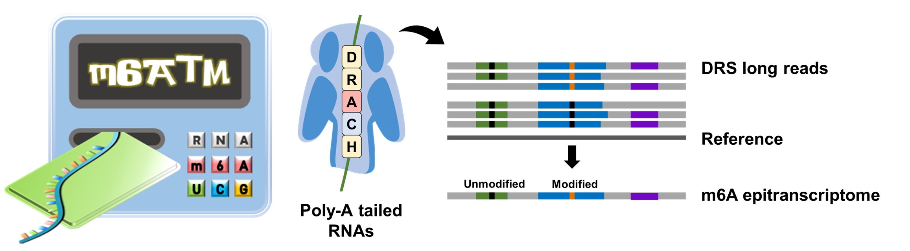

# m6ATM v0.0.1
 

## Installation
```
git clone https://github.com/poigit/m6ATM.git
cd m6ATM/src
```
```shell
conda create -n m6atm python=3.7
conda activate m6atm
python -m pip install .
```
<br>

## Quick Start
```shell
$ m6atm run -f <PATH_TO_FASTQ_DIR> -b <PATH_TO_SORTED_BAM> -r <PATH_TO_REF> -m <PATH_TO_MODEL> -o <PATH_TO_OUTDIR>
```


## Getting Started
### Data preparation from Fast5
We recommend starting from raw .fast5 data to prevent any missing values in requried data. 
However, it is possible to skip this step if basecalled fast5 files and bam files are available. 
For more details, please see: *to be continued*

#### Basecalling
```shell
$ guppy_basecaller -c rna_r9.4.1_70bps_hac.cfg \
-i <PATH_TO_FAST5_DIR> -s <PATH_TO_FASTQ_DIR> \
-x auto -r --compress_fastq --fast5_out  
```
#### Alignment
```shell
$ minimap2 -ax splice -k14 -uf --secondary=no <PATH_TO_REF> <PATH_TO_FASTQ_GZ> > <PATH_TO_SAM>
$ samtools view -hbS -F0x900 <PATH_TO_SAM> > <PATH_TO_BAM>
$ samtools sort <PATH_TO_BAM> -o <PATH_TO_SORTED_BAM> 	
$ samtools index <PATH_TO_SORTED_BAM>
```

### Data preprocessing
m6ATM re-align and collect **current intensity (signal)** and **base proability (trace)** data from each DRACH site. The preprocessed data is stored in numpy array for prediction.
#### Basic
```shell
m6atm preprocess -f <PATH_TO_FASTQ_DIR> -b <PATH_TO_SORTED_BAM> -r <PATH_TO_REF> -o <PATH_TO_OUTDIR>
```
#### Arguments
```
usage: m6atm preprocess -f -b -r -o [-P] [-N] [-m] [-p] [-l] [-L]

Required:
  -f, --fastq      fastq directory generated by Guppy basecaller
  -b, --bam        path to bam file
  -r, --ref        path to reference file
  -o, --out        output directory

Optional:
  -P, --prefix     output file prefix
  -N, --processes  number of processes (default: 1)
  -m, --mem        max memory use per process (default: 10GB)
  -p, --port       port for dask scheculer (default: 8788)
  -l, --min_len    minimum read length (default: 500)
  -L, --max_len    maximum read length (default: 20000)
```

> [!IMPORTANT]
> ```<PATH_TO_FASTQ_DIR>``` is the directory created by Guppy basecaller (not .fastq/.fastq.gz files).<br/>
> If you use basecalled data from Nanopore sequencers, please make sure the folder includes ```./workspace/**.fast5```

#### Output
```m6atm preprocess``` saves preprocessed data in a hdf5 file as following:

    ├── 0                                  # batch number
    ├── 1
    │   ├── m6ATM               
    │       ├── readID_contig_position     # record ID
    │           ├── ctg                    # contig
    │           ├── data                   # signal & trace data
    │           ├── id                     # readID
    │           ├── motif                  # 5-mer motif
    │           ├── pos                    # position on contig
    └── ...

**Signal** and **Trace** data is retrieved in a specific interval (yellow blocks in the figure below) that corresponds to signal segmentation.
 

### Requirements
| Software | Version |
| --- | --- |
| guppy_basecaller | 5.0.11 |
| minimap2 | 2.21-r1071 |
| samtools | 1.12 |
